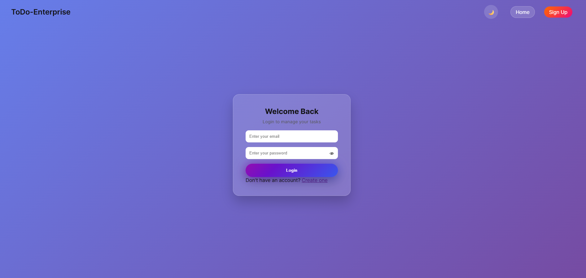
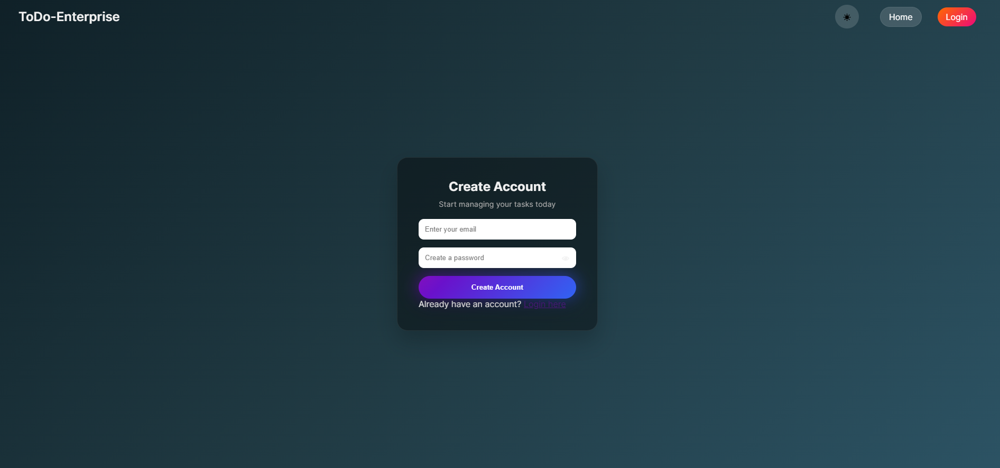
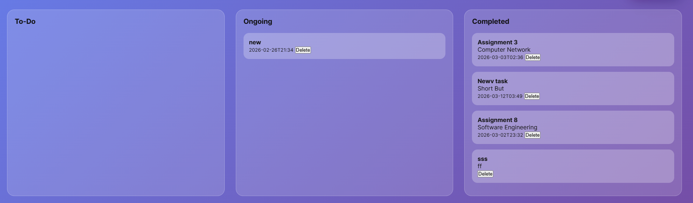

🚀 ToDo-Enterprise
A Luxury SaaS-Style Kanban Task Management Web Application
Built with Firebase, Vanilla JavaScript, and Modern Glass UI Design.

🌟 Overview
ToDo-Enterprise is a modern, responsive, enterprise-style task management system inspired by professional productivity platforms.

It features:

🔐 Secure Firebase Authentication (Login / Signup)

📊 Real-time Kanban Board

🎯 Drag & Drop Task Management

🌓 Animated Dark / Light Mode

🗓 Calendar + Time-Based Task Scheduling

🎨 Glassmorphism SaaS UI

🔄 Real-Time Firestore Sync

👤 User-Based Task Isolation

This project demonstrates full-stack frontend architecture with scalable structure and professional UX design.

🛠 Tech Stack
Frontend
HTML5 (Semantic Markup)
CSS3 (Flexbox, Glass UI, Animations)
Vanilla JavaScript (ES6+ Modular Code)
Backend (BaaS)
Firebase Authentication
Firebase Firestore (Real-time NoSQL Database)

✨ 

🔐 Authentication
Email & Password Signup
Secure Login
Custom Validation (No browser default popups)
Firebase error handling
Auto Redirect Protection
Logout System

📋 Task Management
Add Task with:
Title
Description
Priority
Due Date & Time
Real-time database sync
User-specific task visibility
Delete task
Drag & Drop between:
To-Do
Ongoing
Completed

🎨 UI/UX Enhancements
Glassmorphism cards
Floating gradient CTA button
Animated Moon ↔ Sun Dark Mode toggle
Smooth page fade-in animation
Premium hover glow effects
Stripe-inspired centered navbar
Responsive layout

📁 Project Structure
ToDo-Enterprise/
│
├── index.html        → Landing Page
├── login.html        → Login Page
├── signup.html       → Signup Page
├── home.html         → Protected Dashboard
├── style.css         → Complete UI Styling
└── app.js            → Firebase + Logic

🔥 How It Works
User signs up or logs in via Firebase Auth.
On successful authentication:
User is redirected to the dashboard.
Tasks are stored in Firestore with:
uid
title
description
priority
dueDate
status
createdAt

Real-time snapshot listener updates UI instantly.
Dragging tasks updates Firestore status field.

🔐 Firestore Rules
rules_version = '2';
service cloud.firestore {
  match /databases/{database}/documents {
    match /tasks/{taskId} {
      allow read, write: if request.auth != null;
    }
  }
}

🌓 Dark Mode System
Animated icon transition (🌙 → ☀)
Persistent using localStorage
Smooth gradient background shift
Works across all pages

🧠 Learning Highlights

This project demonstrates:
Authentication flow control
State-based UI rendering
Real-time database architecture
Clean separation of pages
Custom form validation
Stacking context handling (modals)
Responsive SaaS layout design
UX micro-interactions

🚀 Deployment
You can deploy using:
Firebase Hosting
Netlify
Vercel
GitHub Pages (frontend only)
Make sure to configure your Firebase project keys inside app.js.

📸 Screenshots (Add Your Images Here)

Landing Page

Login Page

Dashboard

Dark Mode

Drag & Drop

📈 Future Improvements

🔔 Due date reminders

📊 Analytics dashboard

📱 PWA installable version

🧠 Search & filtering

👥 Role-based access system

📤 Export tasks as CSV

🌍 Multi-language support

👨‍💻 Author
SK Safiur Rahaman
Full-Stack Web Enthusiast

📄 License
This project is for educational and portfolio use.

⭐ If you like this project
Give it a star ⭐ on GitHub
and feel free to fork or contribute.
